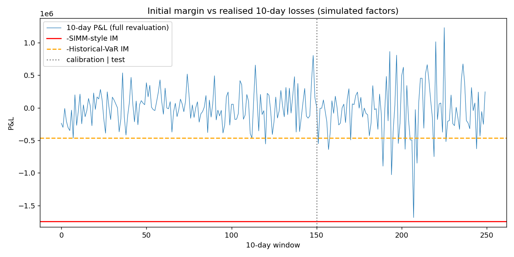

# SIMM-style initial margin engine

I built this to understand how initial margin for uncleared derivatives is actually calculated, from pricing a trade all the way to a single margin number. It prices a small multi-asset portfolio, bumps the market to get sensitivities, aggregates them the way ISDA SIMM does, and then checks the result against 10-day losses.

One thing up front, because it matters: the risk weights, correlations and other parameters in `simm.py` are placeholders I chose for illustration. They are not the ISDA calibrated values, so the margin figures here are not real SIMM numbers. The structure of the calculation follows the published methodology; the numbers do not. The market history used in the back-test is also simulated, since tenor-level rate curves and CDS spreads aren't freely available. If you want real results, swap in the official parameter tables and a real factor history.

## What's in it

The pipeline runs in four steps.

1. **Pricing** (`pricers.py`). Interest rate swaps, a fixed-rate bond, equity options (Black-Scholes), CDS (flat hazard rate, credit triangle) and an FX forward. Swaps and bonds use integer maturities and annual fixed legs to keep things simple.

2. **Sensitivities** (`sensitivities.py`). I bump each risk factor and reprice: 1bp on each of 12 rate tenors per currency, 1% on equity and FX spot, 1 vol point for vega, and 1bp on CDS spreads.

3. **Margin aggregation** (`simm.py`). Weighted sensitivities are combined within a bucket using correlations (tenor correlation for rates), then across buckets using gamma, then across risk classes using a psi matrix. This is done per product class (RatesFX, Credit, Equity) and the product classes are added together. Curvature and base-correlation margin are not implemented.

4. **Back-test** (`im_backtest.py`). I simulate fat-tailed, correlated factor moves with a high-volatility stretch near the end, build non-overlapping 10-day windows, fully reprice the portfolio in each, and count how often the loss exceeds the margin. I compare the SIMM-style margin, which is static, with a historical-VaR margin calibrated on the first 60% of the windows and tested on the rest.

`run_simm.py` ties it together and writes an Excel report and a plot.

## Running it

```bash
pip install -r requirements.txt
python run_simm.py
python -m unittest -v
```

## What it produces

The demo portfolio is a 10-year USD payer swap, a 5-year USD receiver swap, a 7-year bond, a long call and a short put on two stocks, two CDS positions and a USDINR forward.

| Product class | Margin |
|---|---|
| RatesFX | about 846k |
| Equity | about 538k |
| Credit | about 362k |
| **Total** | **about 1.75m** |

Within RatesFX, rates contribute about 692k and FX about 345k, but the combined figure is 846k rather than the 1.04m you'd get by adding them, which is the correlation benefit between the two risk classes. The product classes themselves get no such benefit and are simply summed.

Back-test over 100 test windows (the last 100 of 250, where the volatility jump sits):

| Model | Margin | Exceptions (1 expected) | Worst loss / margin |
|---|---|---|---|
| SIMM-style (static) | about 1.75m | 0 | 0.97 |
| Historical VaR, calibrated early | about 0.46m | 14 | 3.6 |

I put the stress period into the simulated data on purpose, so this shows how the two approaches behave rather than saying anything about real markets. A margin calibrated only on calm data breaks when volatility jumps; a stressed, conservative one holds up but costs more. Note also that the SIMM-style margin got to 97% of its limit in the worst window, so with these placeholder parameters I wouldn't read it as accurate.



## Tests

There are 18 unit tests. They check things like put-call parity, that a swap priced at its par rate is worth zero, that a CDS at the market spread is worth roughly zero, that a payer swap has positive PV01, that the bumped equity delta matches the Black-Scholes delta, that offsetting trades net to zero margin, that margin is sub-additive and scales linearly with notional, and that the Kupiec test behaves sensibly.

## Known gaps

- Placeholder SIMM parameters, and no curvature, base-correlation, concentration or commodity margin.
- Simulated factor history, and the portfolio is held static over each margin period.
- No netting sets or CSA terms, and the FX bucketing is simplified.
- Equity and FX returns could be replaced with real data fairly easily. Rate curves and CDS spreads would need a paid or licensed source.
